# SAE  - Site Ubisoft

## Sujet

[Site Ubisoft](https://iruichek.github.io/page_ubisoft_site/)

## Membres du groupe :

- Étudiant 1 (référente) : [Ruichek Ibtisseme ](mailto:ibtisseme.ruichek@edu.univ-fcomte.fr?subject=SAE_1_05_06)  
- Étudiant 2 : [Taqi Sammy](mailto:sammy.taqi@edu.univ-fcomte.fr?subject=SAE_1_05_06)  
- Étudiant 3 : [Pernot Dylan](mailto:login@edu.univ-fcomte.fr?subject=SAE_1_05_06)  
- Étudiant 4 : [Samil Omeyya ](mailto:omeyya.samil@edu.univ-fcomte.fr?subject=SAE_1_05_06) 

## Présentation du projet

Ce dépôt correspond à un site web créé en HTML/CSS/JS dans le cadre de la SAÉ 05-06 à l'IUT de Belfort-Montbéliard. Ce site présente des informations concernant l'entreprise UBISOFT et sert de vitrine pour présenter l'entreprise, ses activité, son organisation et son historique. Vous trouverez dans ce dépôt et sur le site un rapport économique analysant l'aspect économique de UBISOFT.

## Choix de conception  

Pour la conception du site, nous nous sommes grandement inspirés du site officiel de ******* (disponible [ici](https://www.entreprise.com/fr-fr/)), du site d'un de ses principaux concurrents [xxxxxxxxxx](https://www.entreprise2.fr/) et nous avons pris comme référence la charte de ************** disponible [ici](doc/charte_graphique.pdf).    

## Développement Site Web et Validation des pages

### Page d'Accueil

**Auteur : Pernot Dylan**  

Vérification W3C : [Détail ICI](https://validator.w3.org/nu/?showsource=yes&showoutline=yes&showimagereport=yes&doc=https%3A%2F%2Fdemo-am90.github.io%2Fs1-demo%2Findex.html)

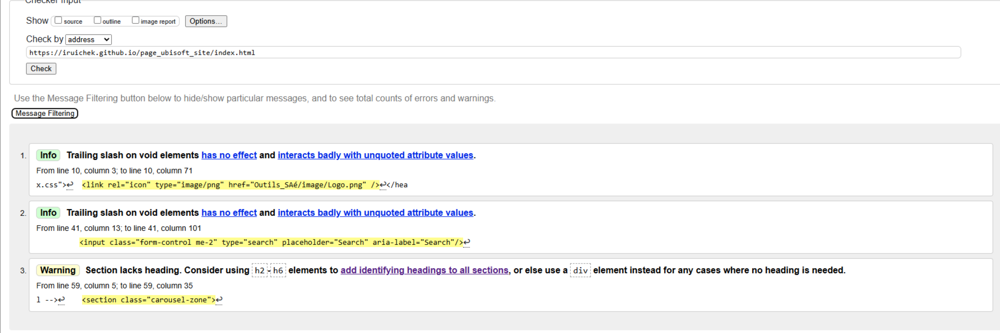

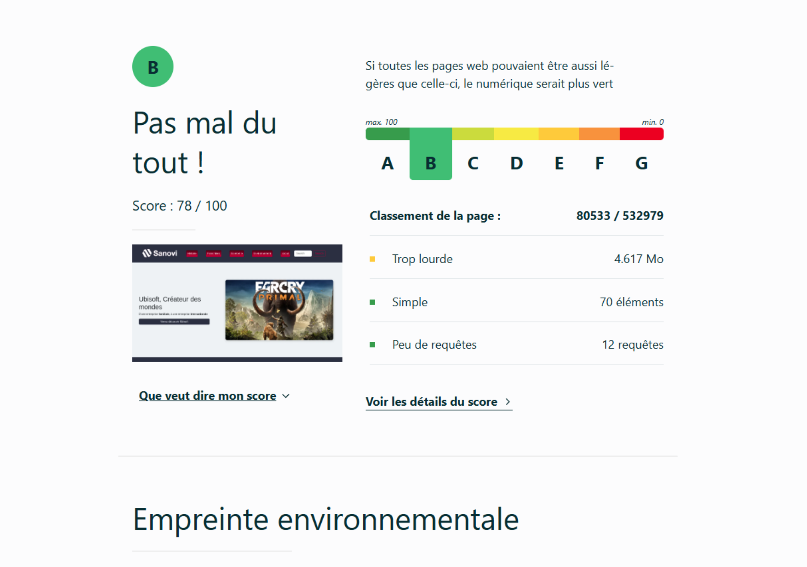

<!--  style="width=400px" ne fonctionne pas -->

### Page Histoire

**Auteur : Pernot Dylan**  

Verification W3C : [Détail ICI](https://validator.w3.org/nu/showsource=yes&showoutline=yes&showimagereport=yes&doc=https%3A%2F%2Fdemo-am90.github.io%2Fs1-demo%2Findex.html)

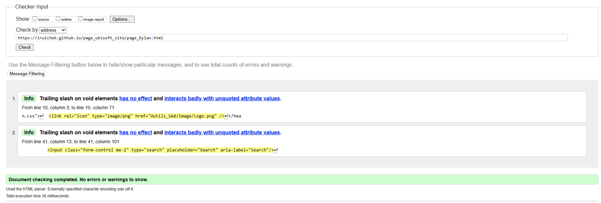

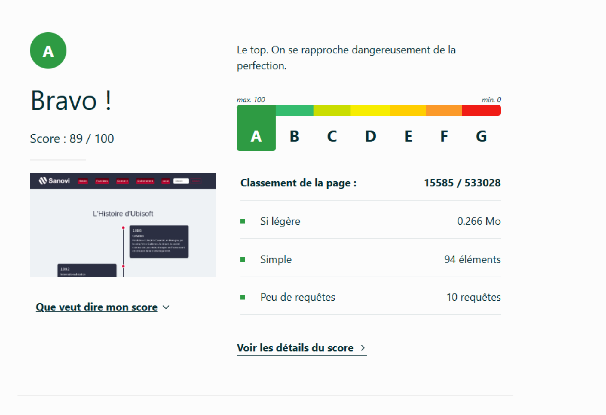

### Page Franchises

**Auteur : Ruichek Ibtisseme **  

Vérification W3C : [Détail ICI](https://validator.w3.org/nu/?showsource=yes&showoutline=yes&showimagereport=yes&doc=https%3A%2F%2Fdemo-am90.github.io%2Fs1-demo%2Findex.html)

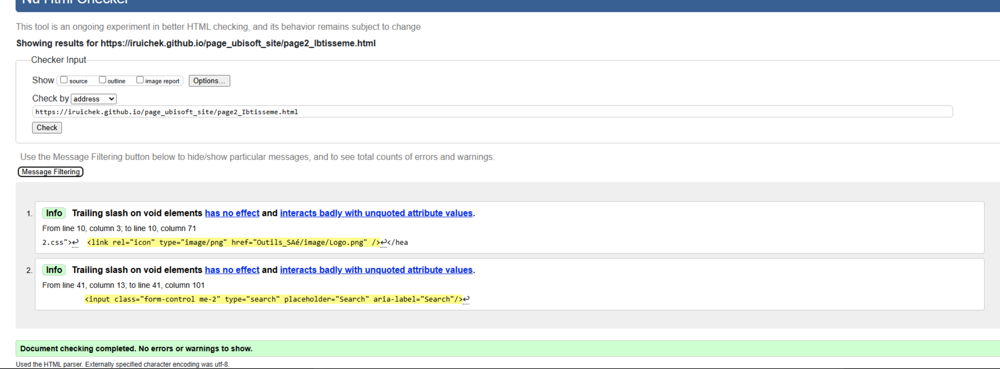

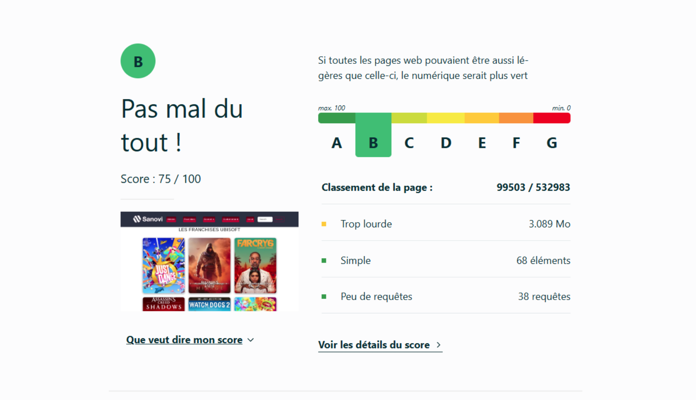
### Page Economie

**Auteur : Omeyya Samil **  

Vérification W3C : [Détail ICI](https://validator.w3.org/nu/?showsource=yes&showoutline=yes&showimagereport=yes&doc=https%3A%2F%2Fdemo-am90.github.io%2Fs1-demo%2Findex.html)

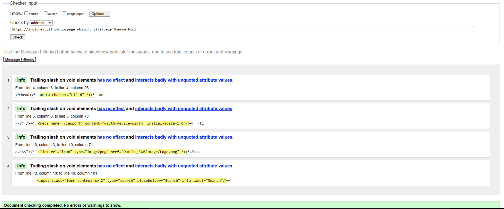

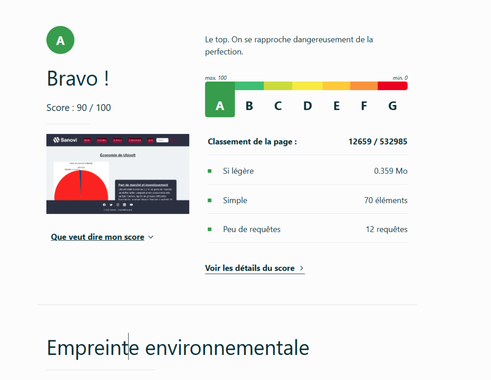

### Page Environnement

**Auteur : Ruichek Ibtisseme **  

Vérification W3C : [Détail ICI](https://validator.w3.org/nu/?showsource=yes&showoutline=yes&showimagereport=yes&doc=https%3A%2F%2Fdemo-am90.github.io%2Fs1-demo%2Findex.html)

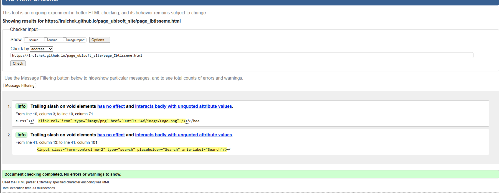

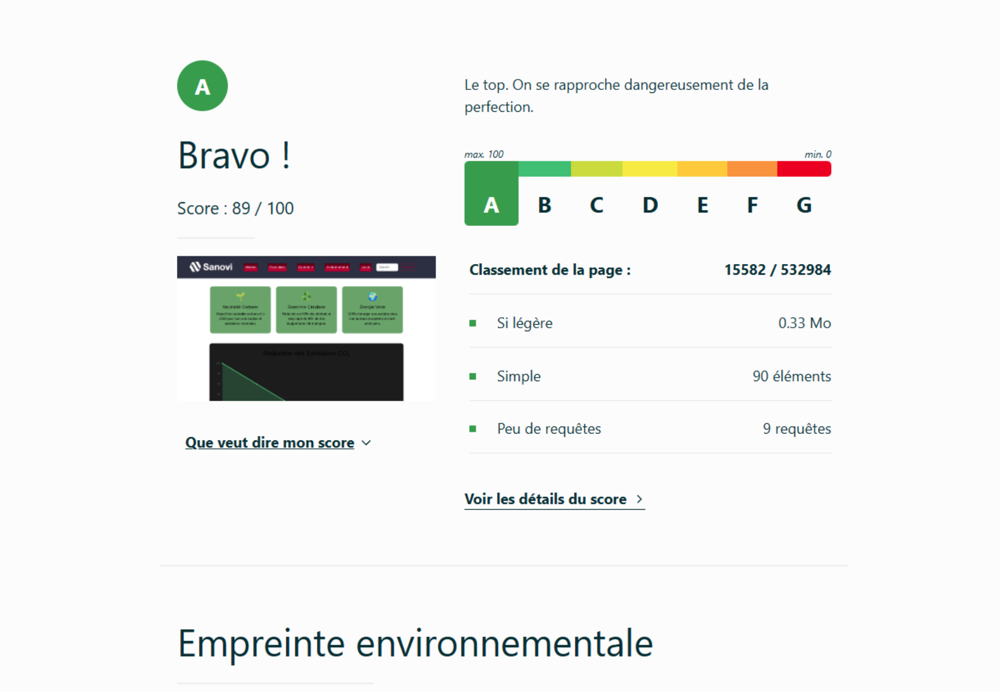

### Page Social

**Auteur : Taqi Sammy**  

Vérification W3C : [Détail ICI](https://validator.w3.org/nu/?showsource=yes&showoutline=yes&showimagereport=yes&doc=https%3A%2F%2Fdemo-am90.github.io%2Fs1-demo%2Findex.html)

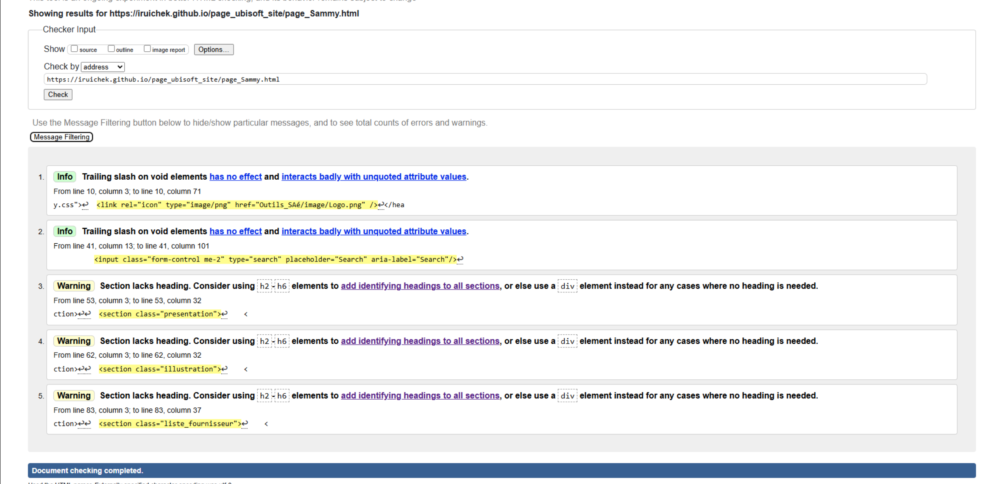

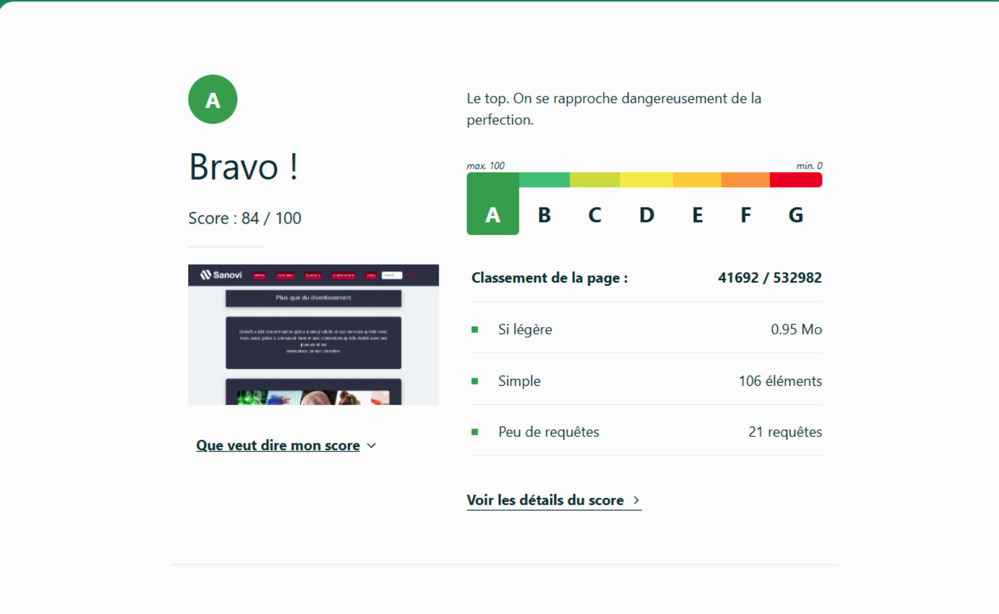
## Répartition du travail

### Planification - Diagramme de GANTT

- Pernot Dylan

### Recherches d'informations

- Ruichek Ibtisseme
- Pernot Dylan
- Taqi Sammy
- Samil Omeyya

### Développement site

- Dylan Pernot
  - Page d’accueil
  - Template Navbar
  - Page Histoire
- Ruichek Ibtisseme
  - Page Franchises
  - Page Environnement
- Taqi Sammy
  - Page Social
  - Template Footer
 - Samil Omeyya
   - Page Economie   

## Contributeurs

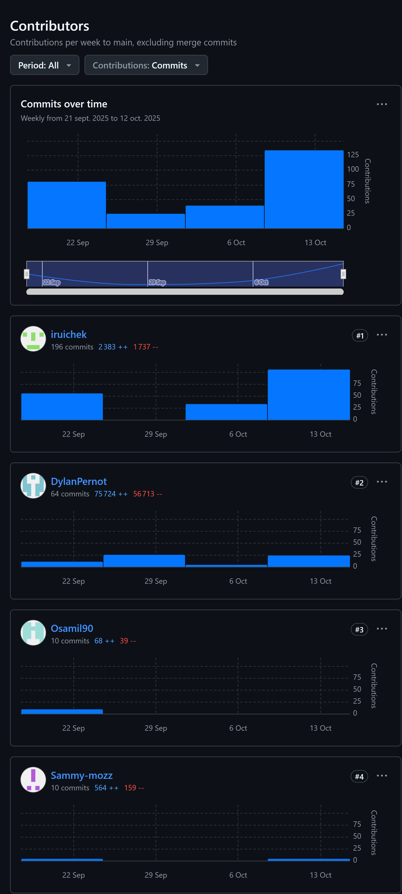

